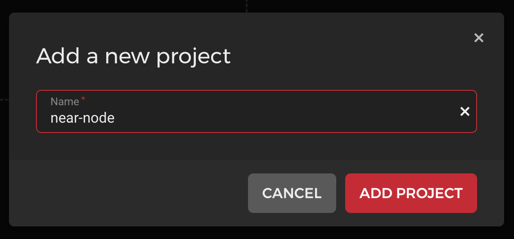
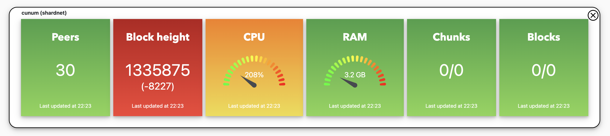

# Setup NEAR validator node on Hetzner cloud

This guide will help you to setup a running NEAR validator node for shardnet on Hetzner Cloud.

# Hetzner Pricing

Pricing differs slightly based on your region (VAT).

Server CPX31: ~14.16 €/mo

500GB Volume: ~23.80 €/mo

Total: ~37.96 €/mo

# Step 1 - Create Hetzner account
Goto https://accounts.hetzner.com/signUp, fill out the registration form with your personal data to create a new Hetzner account.


# Step 2 - Setup Cloud Server
Goto Hetzner cloud console at https://console.hetzner.cloud

### 1) Create new project
Press "Create new project", name it as you like, i.e. "near-node"



### 2) Click "Create Server" on your new project


### 3) Fill out the server configuration form

a) Location and Operating system


Pick server location and operating system as you like. For this guide we will use Helsinki and Ubuntu 20.04, if you use another distribution commands will differ slightly.

b) Hardware


Choose server Standard or Dedicated (dedicated is more expensive but has its own dedicated CPU resources). Near Node minimum requirements for a Chunk-only producer are:


So we have to choose at least CPX31 (4VCPUs, 8GB RAM, 160GB SSD). For this guide we choose "Standard" and "CPX31".

c) Storage

Our server has too few SSD storage (see requirements 500 GB) so create a volume with 500 GB in the next step and name it. (Note: you can also create a volume with less than 500 GB space and expand it over time. Hetzner allows for dynamic resizing, so you only pay for what you need atm.)


d) Networking

Use the default IPv4 + IPv6


e) Firewall

Open the link "Firewalls" in a new Browser tab to setup the Firewall rules for your server.


We have to allow at least a SSH connection (Port 22) to setup and maintain the server, as well as run the NEAR node (Port 24567) and (optional) the NEAR RPC (Port 3030).

So add rules for Port 22, 24567 and 3030 like below.


Name the Firewall rules as you like and press "Create Firewall". Then switch back to the other Browser tab, you can now select the Firewall Rules you just created.


f) Additional Features

Choose as you like, all optional, we choose none for this guide

g) SSH Key

Here we add the SSH public key of our local computer to be able to connect to the server and do the setup.

Press "Add SSH key" and paste your public SSH key in the field.


You can find your public key in the `~/.ssh/` folder of your computer (Linux, Mac), default filename is "id_rsa.pub".

Run ```cat ~/.ssh/id_rsa.pub``` and copy key

If you don't have a ~/.ssh folder and/or public key yet, you can create one by running `ssh-keygen -o -t rsa -b 4096` in the terminal of your computer and follow the instructions. It generates the `id_rsa.pub` together with the secret key.

h) Server name

Set server name as you like.

### 4) Create server

Press "Create & Buy" to finish the setup process.

Goto https://console.hetzner.cloud/ and click on your project to see your server's IP address.


You are now ready to install the NEAR node.

# Step 3 - Setup NEAR Node

### 1) Connect to server

- Open a terminal and type `ssh root@<YOUR_SERVER_IP>` to connect to your server. The SSH key we added above allows to connect without password input.
- If prompted, input "yes" to add host to known hosts.

You are now connected to your server.

- execute `sudo apt update && sudo apt upgrade -y` to update your distribution

### 2) Link mounted volume

As all data will be stored on the mounted 500 GB volume we will link the mounted volume to our workdir in the home folder for easy access.

Run `df -h -x tmpfs -x devtmpfs` to see all available volumes, output should look like this:

````
Filesystem      Size  Used Avail Use% Mounted on
/dev/sda1       150G   85G   60G  59% /
/dev/sda15      253M  1.1M  252M   1% /boot/efi
/dev/sdb        500G   24K  500G   1% /mnt/HC_Volume_21507040
````

So our 500GB volume is mounted on `/mnt/HC_Volume_21507040`.

We now create a symbolic link from our workdir folder in our user home directory to this path by running:

` `

If you run `ls -la ~/` you should see something like this, the symbolic link has been created.

`near -> /mnt/HC_Volume_21507040`

You can now access the volume by changing directory to `~/near`, we will work in this directory from now on.

### 2) Install Client

- Execute below to install NodeJS
```
curl -sL https://deb.nodesource.com/setup_18.x | sudo -E bash -  
sudo apt install build-essential nodejs
PATH="$PATH"
```
- Execute`sudo npm install -g near-cli` to install Near Client
- Execute `echo 'export NEAR_ENV=shardnet' >> ~/.bashrc` to permanently set your Near Client environment to shardnet

### 3) Client Login

- make sure you setup a wallet at https://wallet.shardnet.near.org/
- execute `near login`
- You are presented with a URL, copy it and paste it in your Web Browser. Follow instructions to grant Access to your Near CLI
- After granting access, you will see a webpage that says "Site can't be reached", fear not, this is normal, go back to console and enter your wallet (xx.shardnet.near)
- Note: wait a minute until you hit enter, the access grant might take some time to be propagated
- After you press Enter there should be a success message

### 3) Install Near Core Prerequisites

- Install developer tools
```
sudo apt install -y git binutils-dev libcurl4-openssl-dev zlib1g-dev libdw-dev libiberty-dev cmake gcc g++ python docker.io protobuf-compiler libssl-dev pkg-config clang llvm cargo curl jq
```
- install python
```
sudo apt install python3-pip
USER_BASE_BIN=$(python3 -m site --user-base)/bin
export PATH="$USER_BASE_BIN:$PATH"
```
- install building env
```
sudo apt install clang build-essential make
```
- install rust and cargo
```
curl --proto '=https' --tlsv1.2 -sSf https://sh.rustup.rs | sh
```

You will see output like this:


Press 1 and press enter.

Source the environment
```source $HOME/.cargo/env```

### 3) Install Near Core

a) Checkout project

Make sure you are in your workdir (on the 500 GB volume):
```
cd ~/near
```

Then run:

```
git clone https://github.com/near/nearcore
cd nearcore
git fetch
```

Run ```git checkout <commit>``` to checkout a specific commit id or tag with ```git checkout tags/<tag>```. The recommended current commit id and/or tag is posted on Discord under announcements.
Current recommended tag at time of this writing is `shardnet`.

```git checkout tags/shardnet```

b) Build Near Core

Change directory to nearcore folder and run to build: 

```
cd nearcore
cargo build -p neard --release --features shardnet
```

The binary path is `target/release/neard`

### 4) Init Node configuration

Now we have to initialize the configuration files by running:

`./target/release/neard --home ~/.near init --chain-id shardnet --download-genesis`

This command will create the directory structure and will generate `config.json`, `node_key.json`, and `genesis.json`. Under `~/.near` you should see the files.

- config.json - Configuration parameters which are responsive for how the node will work. The config.json contains needed information for a node to run on the network, how to communicate with peers, and how to reach consensus. Although some options are configurable. In general validators have opted to use the default config.json provided.

- genesis.json - A file with all the data the network started with at genesis. This contains initial accounts, contracts, access keys, and other records which represents the initial state of the blockchain. The genesis.json file is a snapshot of the network state at a point in time. In contacts accounts, balances, active validators, and other information about the network.

- node_key.json - A file which contains a public and private key for the node. Also includes an optional account_id parameter which is required to run a validator node (not covered in this doc).

- data/ - A folder in which a NEAR node will write it's state.

We have to replace the config with the most up-to-date one by running

```
rm ~/.near/config.json
wget -O ~/.near/config.json https://s3-us-west-1.amazonaws.com/build.nearprotocol.com/nearcore-deploy/shardnet/config.json
```

Now we have to also create a `validator_key.json` file in the `~/.near` folder which contains the signing keys of your node. If you already did the near client login procedure (see chapter 3 - Client Login) we already have the key file stored on the system.

We move it to the `~/.near` folder by running (replace xx with your wallet id):

```
cp ~/.near-credentials/shardnet/xx.shardnet.near.json ~/.near/validator_key.json
```

Edit the `validator_key.json` by running
```
vi ~/.near/validator_key.json
```

- Edit “account_id” => add "factory", so it looks like this xx.factory.shardnet.near, where xx is your PoolName
- Change "private_key" to "secret_key"

It should looks like this:

```
{
  "account_id": "xxxx.factory.shardnet.near",
  "public_key": "ed25519:####",
  "secret_key": "ed25519:****"
}
```

Node setup is done now.

### 5) Setup systemd command

In order to easily start and stop der Node we set it up as a service.

- Run `sudo vi /etc/systemd/system/neard.service`
- Paste

```
[Unit]
Description=NEARd Daemon Service

[Service]
Type=simple
User=<USER>
#Group=near
WorkingDirectory=/home/<USER>/.near
ExecStart=/home/<USER>/near/nearcore/target/release/neard run
Restart=on-failure
RestartSec=30
KillSignal=SIGINT
TimeoutStopSec=45
KillMode=mixed

[Install]
WantedBy=multi-user.target
```

The service will auto restart on failure and on startup and can be easily started/stopped by running:
```
sudo systemctl start neard
sudo systemctl stop neard
```
We now enable and start it with:

```
sudo systemctl enable neard
sudo systemctl start neard
```

Logs can be seen with ```journalctl -n 100 -f -u neard```

### 6) Setup stake pool

As your node is now operational you can setup your stake pool. 

Run:

```
near call factory.shardnet.near create_staking_pool '{"staking_pool_id": "<pool_id>", "owner_id": "<account_id>", "stake_public_key": "<public_key>", "reward_fee_fraction": {"numerator": 5, "denominator": 100}, "code_hash":"DD428g9eqLL8fWUxv8QSpVFzyHi1Qd16P8ephYCTmMSZ"}' --accountId="<account_id>" --amount=30 --gas=300000000000000
```

Replace before execution:
- pool_id => name your pool (example "stakewars")
- account_id => your shardnet account (from the wallet you created prior: xx.shardnet.near) that will manage the staking pool
- public_key => the public_key from the validator_key.json file

Execute command and if there is a “True” at the end of the output your pool is created.

Check your pool is now visible on https://explorer.shardnet.near.org/nodes/validators

You should now stake some NEAR to your pool by running

```
near call <staking_pool_id> deposit_and_stake --amount <amount> --accountId <account_id> --gas=300000000000000
```

Replace before execution:

- staking_pool_id => for example "stakewars.factory.shardnet.near"
- account_id => like above "xx.shardnet.near"
- amount => how much stake, i.e. 500

### 7) Setup ping command

A ping issues a new proposal and updates the staking balances for your delegators. A ping should be issued each epoch to keep reported rewards current.

The command is:
```
near call <staking_pool_id> ping '{}' --accountId <account_id> --gas=300000000000000
```

This command has to be executed periodically, so we create a cron job for it.

Create a new Crontab by running ```crontab -e``` and paste the following (replace staking poolId and accountId):

```
*/5 * * * * near call <staking_pool_id> ping '{}' --accountId <account_id> --gas=300000000000000
```

Every 5 minutes this cron job executes the ping command. Save and close the file and it's active.

### 8) Monitoring

You can monitor your node via the RPC endpoint. At `http://<YOUR_SERVER_IP>:3030/metrics` you can view the node metrics to build a dashboard.

If you want a quick and easy Monitoring solution, you can use the Cunum NEAR Validator Metrics dashboard. Just fill in your node's host (RPC port 3030 of your node must be reachable) and press "Add Metrics" to configure the dashboard and you are good to go.

https://near.cunum.com/metrics

